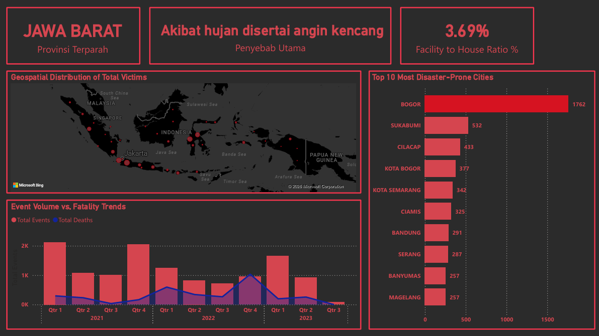
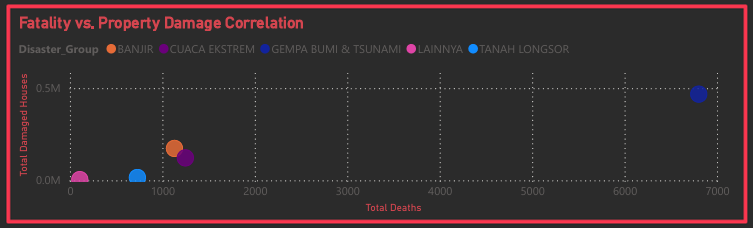
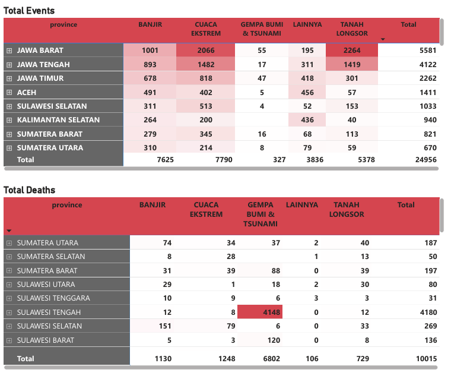

# 🇮🇩 National Disaster Impact Analysis (2020–2023)

## 📌 Project Overview

This project analyzes **28,000+ disaster records across Indonesia** to uncover patterns between disaster frequency, human casualties, and infrastructure damage.

The goal is simple:  
move from **“data reporting” → “decision-making tool.”**

---

## 🔍 Key Analysis & Strategic Impact

### 📈 1. Are Disasters Getting Worse — or Just More Frequent?

The dashboard shows that while disaster frequency fluctuates, total victims (83K) and infrastructure impact (6M) continue to grow.

👉 This reveals a critical gap:  
even when disasters don’t increase significantly, their severity does.

**Impact:**  
This signals that current mitigation strategies are not scaling effectively. Authorities should shift focus from response capacity → resilience building, such as stronger building standards and better evacuation systems.

---

### 🌍 2. Where Should We Actually Focus?

Geospatial analysis highlights clustered hotspots—especially in Jawa Barat (Bogor, Sukabumi) where both frequency and impact are high.

👉 Not all regions need equal attention—risk is concentrated.

**Impact:**  
Instead of spreading resources thin, this enables pre-positioning logistics in high-risk zones, reducing response time to under 2 hours, and creating more efficient disaster budgeting.

---

### ⚖️ 3. Not All Disasters Are Equal

By comparing fatalities vs infrastructure damage:

- Earthquakes → high deaths, lower frequency  
- Floods & extreme weather → massive economic damage  

👉 This shows two different problem types:  
human survival risk and economic/system disruption risk.

**Impact:**  
Budget allocation should be split strategically—prioritizing early warning and evacuation drills in high-fatality zones, and infrastructure investment (drainage, urban planning) in high-damage areas.

---

### ⏱️ 4. When Is the System Under Pressure?

Quarterly trends show spikes in disaster events and deaths during Q4–Q1 (monsoon season).

👉 Risk is not constant — it’s seasonal and predictable.

**Impact:**  
This enables temporary workforce scaling, increased readiness during peak periods, and faster response within the “golden hour” window.

---

### 🧱 5. Hidden Structural Problem: Damage vs Intensity

Some regions show high infrastructure damage despite relatively low disaster intensity.

👉 This is not a disaster problem — it’s a policy/building quality problem.

**Impact:**  
This highlights the need to audit and enforce building codes, prioritize retrofitting over rebuilding, and reduce long-term recovery costs significantly.

---

## 🧠 Final Takeaway

This analysis shows that disaster management is not just about how often disasters happen, but about where, when, and how severe the impact is.

The real value of this dashboard:

> Turning raw disaster data into **targeted, actionable decisions.**

---

## 🛠️ Technical Implementation

- **Tools:** Power BI, Power Query, DAX  
- **Key Features:**
  - Dynamic YoY calculations  
  - Geospatial hotspot mapping  
  - Correlation analysis (fatality vs damage)  
  - Drill-down exploration (province → city level)  

---

## 🔗 Resources

- 📊 Dashboard: [Insert Link]  
- 📄 Documentation: [Insert Link]  
