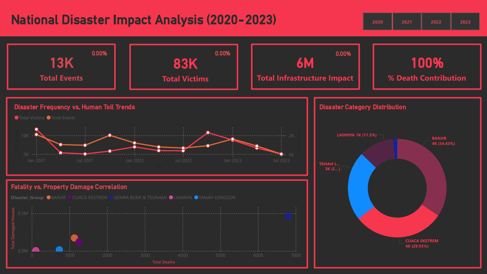

# 🇮🇩 National Disaster Impact Analysis (2020–2023)

## 📌 Project Overview
This project analyzes more than **28,000 disaster records across Indonesia** to uncover how disasters impact people and infrastructure. The dashboard is built not just to report data, but to support **data-driven decision making** in disaster management.

---

## 🔍 Key Analysis & Impact

- **Rising Severity Despite Stable Frequency**  
  The data shows that while disaster frequency does not increase significantly, the total number of victims (83K) and infrastructure damage (6M) continues to grow. This indicates that disasters are becoming more severe, not more frequent. The implication is clear: current mitigation efforts are not keeping up with impact, and investment needs to shift toward **resilience-building measures** such as stronger infrastructure and improved preparedness systems.

- **Concentrated Regional Risk (Jawa Barat Hotspot)**  
  Geospatial analysis highlights that disaster impact is heavily concentrated in specific regions, especially Jawa Barat (Bogor and Sukabumi). This means risk is not evenly distributed across the country. With this insight, resource allocation can be optimized by focusing on high-risk areas, enabling **faster emergency response and more efficient use of logistics and budget**.

- **Different Disaster Types, Different Strategies**  
  The comparison between fatalities and infrastructure damage reveals two distinct patterns: earthquakes tend to cause higher deaths, while floods and extreme weather drive larger economic losses. This distinction shows that a single mitigation strategy is ineffective. Instead, it supports a more targeted approach—**prioritizing evacuation systems for high-fatality risks and infrastructure investment for high-damage risks**.

- **Seasonal Disaster Patterns (Q4–Q1 Peak)**  
  The data consistently shows increased disaster activity and impact during the monsoon period (Q4 to Q1). This confirms that disaster risk is cyclical and predictable. As a result, emergency response planning can be adjusted seasonally, allowing for **temporary scaling of workforce and resources during peak periods without increasing permanent operational costs**.

- **Infrastructure Vulnerability Beyond Disaster Intensity**  
  Some regions experience high infrastructure damage despite relatively low disaster intensity, indicating that the issue lies in structural vulnerability rather than the disasters themselves. This insight highlights the importance of **policy intervention, such as enforcing building standards and prioritizing retrofitting**, to reduce long-term losses.

---

## 🧠 Conclusion
This analysis shows that disaster management is not just about responding to events, but about understanding **where impact is concentrated, how risks differ, and when they peak**.

By translating raw data into actionable insights, this project enables more **focused, efficient, and strategic decision-making** in disaster mitigation and response.

---

## 🛠️ Technical Implementation
- Power BI  
- Power Query  
- DAX (for dynamic KPI & YoY analysis)

---

## 🔗 Resources
- 📊 Dashboard: [Insert Link]  
- 📄 Documentation: [Insert Link]
